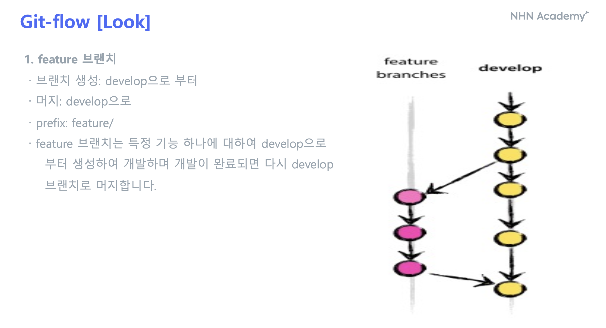
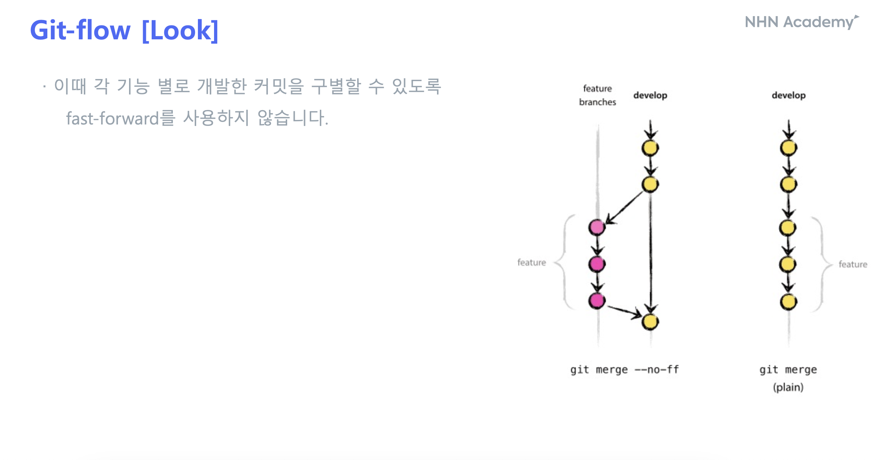
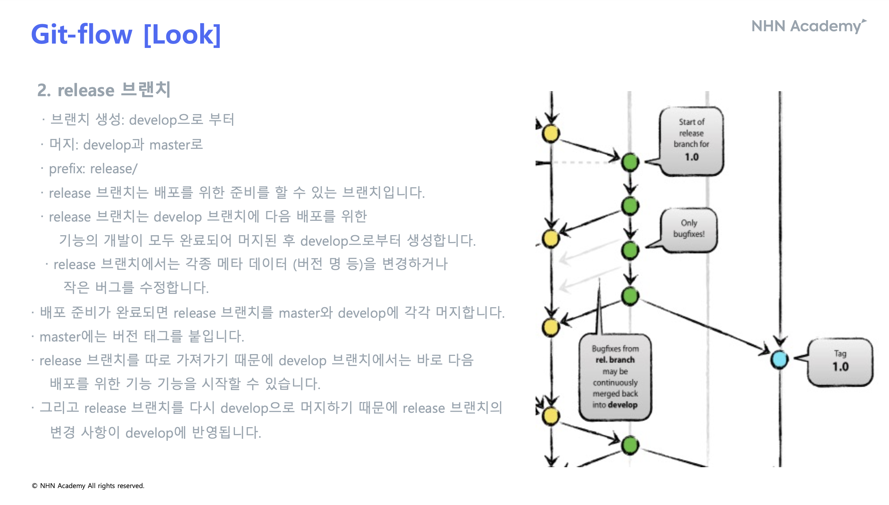
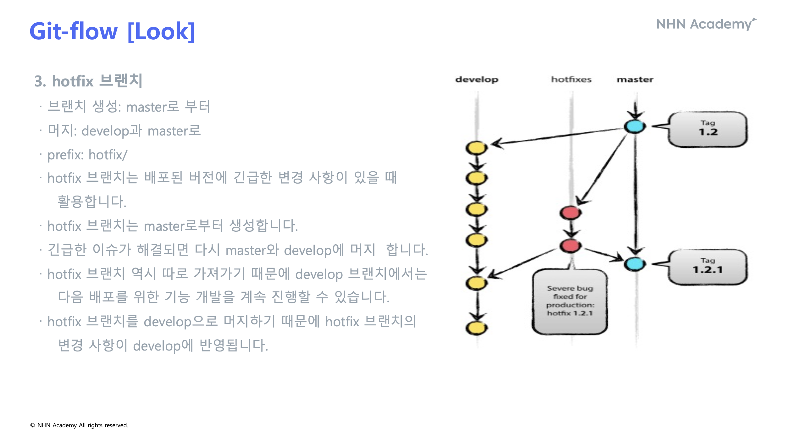
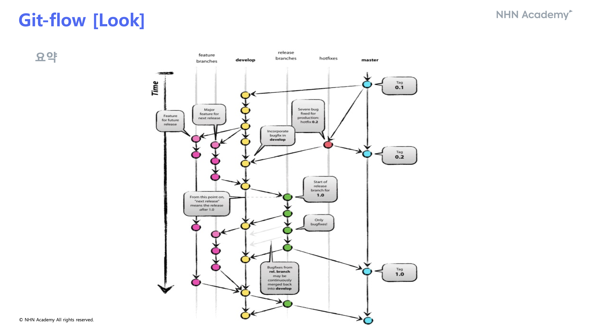

= GitHub

== [명령어]

=== 새로운 브랜치 생성

 git branch [브랜치명]

=== 브랜치 변경

 git switch [브랜치명]

=== 현재 작업 디렉토리의 상태를 확인

 git status

=== 커밋 기록 확인

 git log

=== 원격 저장소에서 변경 사항을 가져옴
 git fetch

== 파일 추가 및 커밋
 git add .
 git commit -m [커밋 이름]

=== 변경 사항을 원격 저장소에 반영
 git push origin [브랜치명]

=== 원격 저장소의 변경 사항을 가져와서 현재 브랜치에 병합
 git pull

=== 다른 브랜치와 병합
 git merge [합칠 브랜치명]

=== 커밋을 되돌림
 git reset

=== 현재 작업 중인 변경 사항을 임시로 저장
 git stash

=== conflict 해결방법
1. 충돌나는 코드중 한쪽 코드만 선택
2. git add
3. git commit -m [커밋 이름]

=== branch, merge 내용을 그래프로 보는 방법
 git log —online —all —graph

== [Git-flow]
=== 서포팅 브랜치
- master과 develop 외에 팀 멤버들이 병렬로 일할 수 있도록 도와주는 브랜치
- 메인 브랜치와는 다르게 필요할 때 생성하였다가 삭제

1. feature 브랜치
2. release 브랜치
3. hotfix 브랜치

